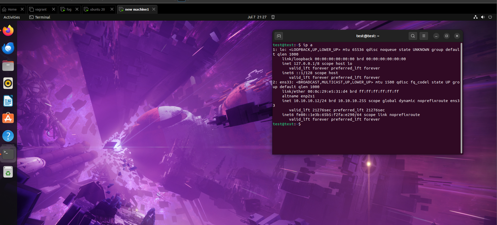

# Fog basic

Fog is a tool use to capture and deploy operatin systems. the tool is pretty complete it comes with is own dhpc tftp and it can even make itw own ssl certificate. I will show how i used fog. Firstly i used 3 virtual machine first is the foc server(ubuntu server 24.01) than machine1 the machine i will use to clone (ubuntu desktop 24.04) finaly there a blank virtual machine i will use to copy the OS. This machine work with every type of OS You can copy Windows servers aswell i didnt because my computer didnt have enough space<br><br> I use vmware workstation 17.5.2 and i used nat with a network <strong>10.10.10.0/24</strong> gateway <strong>10.10.10.2</strong>.

## Fog installation
There are many site that show you steps to install fog but i decided to use official site of fog: ```https://docs.fogproject.org/en/latest/installation/server/install-fog-server/```.

Enter the following commands in root
```bash
sudo -i
apt-get -y install git
cd /root
git clone https://github.com/FOGProject/fogproject.git
cd fogproject
git fetch --all
cd /root/fogproject/bin
./installfog.sh
```

After the last command a interactive questionnaire will let you configure FOG your own way. The most important part is for FOG default inteface to be your Nat interface and to use the fog dhcp service and not a external because We are using Nat.

after the installation is complete your admin username and password will be given on screen. Just enter ```
http or https://you-fogserver-ip/fog``` to enter to the service

## create image template
To start we need to create a image template 

<br>after selecting create image you really only need to fill 2 categories. The <strong> Image Name</strong> and <strong> Operating system </strong>

## machine registration 
this part might be a little tricky. Before registration a machine make sure the fog DHCP is working. To start we need to get in the bios of machine1. While in the Bios we will change the bootorder.<br><br>

<br>usualy ubuntu will be on top but to be able to register and capture a image it need to be below efi network  and cdrom Drive.

after that just restart your machine and you should see something like this<br><br>
<br>Just select Quick Registration and Inventory to start the process.<br> When the process is done if you go in your Fog host management seciton and you should see this<br><br>


## host assignment
Now we need to assign the host to the image we created a couple minutes ago. select the image and you should see this<br><br>
<br>In this section you just have to go in the Host image category and select the image

## task creation
The last step before capturing image is to create a task to capture the image.<br><br>

The orange task is to capture an image.<br>After this go in the task tab. <br><br> 
<br>On top of the blue arrow there will be another design just select it to force task to run immediately.

## image capture
Just restart machine1 to start the process. after a couple of minutes you will see this<br><br>
<br>As you can see its capturing my VM which has a size of 15GB. after its done the image in fog should show it has a size.<br><br>

## Deploying Images
In this part we will create the new vm to deploy the image

first create a Virtual machine without a iso image<br><br>

<br>after starting the machine you should see the basic fog screen again but this time we will select Deploy image

<br><br>

<br>enter the admin username and password of fog<br><br>

<br>If there was multiple images i would select the one i want but after this the deploying process should start.<br><br>


## End
Now the exact same operating system will be installed but with different mac address. It could be very useful if i want to test a new system on a server but it might crash it. So i can make a copy of a existing server of Operating system and try new project. 

But let me show you proof of it working


<br><br>

<br>Machine1 <br><br>

Cloned machine.